# 🏎️ Proyecto Fórmula 1 - Gestión de Pilotos, Escuderías, Circuitos y Tiempos

Este proyecto es una aplicación web desarrollada con **FastAPI + SQLAlchemy + Jinja2** que permite gestionar información de **pilotos, escuderías, circuitos y tiempos de carrera**.  
Incluye funcionalidades de creación, edición, eliminación lógica (soft delete) y restauración de registros, además de formularios y vistas dinámicas.

---

## 📐 Diagrama de Clases

```mermaid
classDiagram
    Piloto --> Escuderia : pertenece
    Tiempo --> Piloto : registrado por
    Tiempo --> Circuito : realizado en
    Escuderia --> Piloto : tiene (máx 2)
    Circuito --> Tiempo : acumula
```


```mermaid
🔄 Diagrama de Actividades
flowchart TD
    A[Usuario] --> B[Formulario creación]
    B --> C[Validación datos]
    C -->|Correcto| D[Guardar en BD]
    C -->|Error| E[Mostrar mensaje]
    D --> F[Listado activo]
    F --> G[Eliminar registro]
    G --> H[Marcar activo=False]
    H --> I[Listado eliminados]
    I --> J[Restaurar registro]
    J --> F


